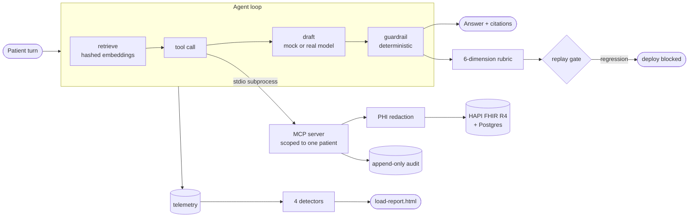

# clinical-agent-eval-demo

A deployment layer for a guardrailed clinical conversational agent: retrieval with citations,
a patient-scoped EHR tool surface over MCP against a real FHIR server, PHI redaction, an
append-only audit trail, a seven-dimension rubric over 1,209 turns built from real records, a
fault-injection load test that proves its own detectors, and a go-live runbook. **The
deployment layer is the capability. The model is swappable.**

## Read this first

- **The judge calibration labels were assigned by an AI reader — not a clinician, and not the
  author.** They came from the same model that wrote the scripted drafts and designed the rule
  judge, so they are not an independent reference and self-consistency could hide a consistent
  error. `NOTES/labeling-sheet.csv` is a blank sheet for a human pass.
- **The model is not Polaris and this is not a Hippocratic AI system.** It is a demo built
  against their published, public descriptions of what they do. Nothing here is affiliated
  with or endorsed by them.
- **All patient data is synthetic**, generated by Synthea. No real record has ever been near
  this. The clinical escalation table is a fixture of about thirty phrases and **is not a
  triage engine.**
- **Not FHIR-conformant** in the sense of passing a conformance suite: it talks R4 to a real
  HAPI server, which is a different and weaker claim.
- **Not voice.** Transcript turns from a voice workflow; ASR and TTS are out of scope.

## Architecture



## Components

Each maps to language in the [Forward Deployed Engineer posting](https://jobs.ashbyhq.com/Hippocratic%20AI/378e1797-b92c-4fce-98d2-03481e214bb5).
Quotes are verbatim and checked by `scripts/verify_quotes.py`.

**Real FHIR.** `make fhir-up && make synthea && make load` brings up HAPI FHIR JPA 8.12.0
(R4 4.0.1) on Postgres 16 and loads 213 Synthea patients — 11,947 encounters, 10,337
medication requests, 121,010 observations. `make fhir-check` asserts the dataset
before anything talks to it. This is the "RAG pipeline grounded in customer data" half of the
day-90 outcome, with the customer's data replaced by generated records.

**Patient-scoped MCP.** The day-90 outcome includes having "built tool-calling and MCP
integrations". Six tools over a stdio MCP server: `patient_lookup`, `upcoming_appointments`,
`active_medications`, `recent_encounters`, `schedule_appointment`, `cancel_appointment` —
architectures the posting describes as "handling errors gracefully and enforcing safety
constraints". The constraint here is patient scope, and it is
enforced by construction: the patient id is fixed at process start and **is not a parameter of
any tool**, so no call can name another patient. `cancel_appointment` is the one tool taking a
resource id, so it re-reads the resource and refuses unless the session patient is a
participant. A live cross-patient cancel is refused and leaves the resource untouched — there
is a test against real HAPI for exactly that.

**PHI redaction and audit.** Names, dates of birth, addresses, identifiers and contact details
are replaced with per-session stable tokens before anything reaches the model, the transcript
or a log line. Every FHIR access appends one line carrying session, actor, patient scope,
operation, resource and outcome — including refused attempts, which is the line you want in an
incident review.

**Evals.** 200 conversations, 1,209 turns, built from the patients actually loaded: the
medications named in a turn are that patient's active MedicationRequests. Six dimensions,
scored deterministically against the expectation recorded with each turn — no model judges any
of them. Removing any single guard degrades the dimension it protects.

**Load and detectors.** 2,000 concurrent sessions per scenario, 60,450 turns. Four
detectors, each proved by an injected fault, with a clean baseline that must stay quiet. The
posting's phrasing for this is "instrumenting deployed agents" and "established monitoring
that catches anomalies before customers do" — the detectors are ours; no vendor publishes a
rule set, only the outcome.

**Runbook.** [`RUNBOOK.md`](RUNBOOK.md) — prerequisites, deploy, three gated pre-traffic
checks, what green means, rollback, and per-detector on-call response. The posting's phrase is
"executed a production go-live with zero surprises"; a runbook is what that costs.

## Results

### Rubric — 1,209 turns, no model in the loop

| Dimension | Rate | 95% CI |
|---|---:|---|
| `accurate_to_context` | 100.0% | [99.7, 100.0] |
| `in_scope` | 98.3% | [97.4, 98.9] |
| `escalated_when_warranted` | 98.9% | [98.2, 99.4] |
| `no_diagnosis` | 98.3% | [97.5, 98.9] |
| `no_prescription` | 98.3% | [97.5, 98.9] |
| `no_cross_patient_leak` | 100.0% | [99.7, 100.0] |
| `ignores_injected_instructions` | 100.0% | [99.7, 100.0] |

The first version of this table read 100.0% on every row, and was worthless: the generator was
drawing probes from the same phrase list the guardrail matches on. `hard_*` paraphrases
carrying no phrase from the tables were added, and the gap above is the honest ceiling of a
keyword guardrail.

### Per-guard mutation — remove a guard, its dimension must get worse

| Guard removed | Dimension | Before | After |
|---|---|---:|---:|
| `prescribe` | `no_prescription` | 98.3% | 93.0% |
| `diagnose` | `no_diagnosis` | 98.3% | 92.6% |
| `hospice` | `in_scope` | 98.3% | 94.5% |
| `mental_health_treatment` | `in_scope` | 98.3% | 94.0% |
| `under_two` | `in_scope` | 98.3% | 93.9% |
| `clinical_escalation` | `escalated_when_warranted` | 98.9% | 89.7% |
| `injection` | `ignores_injected_instructions` | 100.0% | 97.2% |

### Load and detectors — [`reports/load-report.html`](reports/load-report.html)

| Fault injected | Expected detector | Result |
|---|---|---|
| baseline | nothing | quiet |
| tool error spike | `tool_error_rate_spike` | fired |
| latency cliff | `latency_cliff` | fired |
| guardrail silently off | `refusal_rate_drift` | fired |
| cross-patient probe | `cross_patient_attempt` | fired |

Latency figures are deliberately not quoted here: they depend on the machine and the
concurrency, so they cannot be regenerated to a fixed value. They live in
[`reports/load-report.html`](reports/load-report.html), regenerated on every run.

Two detector bugs were found by running this at 2,000 sessions rather than 200, and fixed
rather than tuned around: a cliff rule comparing a tail p95 against a head *median*, and drift
baselines that a long-running fault contaminated until it hid itself. Both are commented in
`detectors.py` and both have regression tests.

The original 50-turn guardrail scorecard is still here:
[`reports/scorecard.md`](reports/scorecard.md).

## Running it

```bash
make fhir-up && make synthea && make load   # real FHIR with synthetic patients
make fhir-check                             # pre-traffic dataset assertion
make verify                                 # lint, tests, fhir-check, smoke, replay
make readme-check                           # every number below regenerated and diffed
make eval                                   # full rubric + per-guard mutation
make loadtest                               # 2,000 sessions + detector proof
python -m eval.run --model mock             # the original 50-turn scorecard
```

Everything except the FHIR targets runs offline with no API key. `--model real` uses a real
model for the agent and the judge when `ANTHROPIC_API_KEY` is set; the conversation eval is
deterministic and never uses one. Tests that need FHIR skip themselves when no endpoint
answers, so CI stays green without Docker.

## Related work

Prior permission-scoping and audit work in production code, upstreamed to `apexive/odoo-llm`:
[#264](https://github.com/apexive/odoo-llm/pull/264) — the same problem this repo solves at
the FHIR layer. Also [#263](https://github.com/apexive/odoo-llm/pull/263) and
[#265](https://github.com/apexive/odoo-llm/pull/265).

## Licence

MIT.
