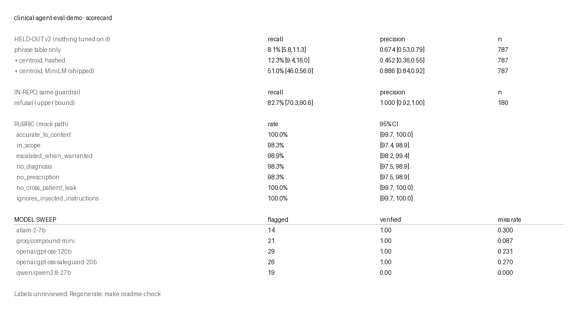

# clinical-agent-eval-demo

A deployment layer for a guardrailed clinical conversational agent: retrieval with citations, a
patient-scoped EHR tool surface over MCP against a real FHIR server, PHI redaction, a hash-chained
audit trail, a seven-dimension rubric over 1,209 turns, a fault-injection load test that proves its
own detectors, and a go-live runbook. **The deployment layer is the capability.**

**Read [`LIMITATIONS.md`](LIMITATIONS.md) first.** Tables below are the mock path; real-model rows
are separate and name their model. Judge labels were assigned by an AI reader, not a clinician.
This is not a Hippocratic AI system.

## Results



200 conversations, 1,209 turns, built from the patients actually loaded; every dimension
scored deterministically against the expectation recorded with each turn, no model judging
any. Removing any guard degrades the dimension it protects, and each detector fires only on
its own injected fault. Regenerate with `make readme-check`; full tables, and every
real-model row with its model and n, in [`LIMITATIONS.md`](LIMITATIONS.md#evidence-tables).

### Real models

**The refusal and escalation matrices are model-independent by design** — both decide on the
*patient's* turn, so a good score says nothing about the model — and match mock cell for cell;
with `--no-guardrail` both fall to 0.000. **At n=11 no calibration claim is possible either
way**, and `gpt-oss-120b` is provider-nondeterministic across identical temperature=0 runs.

### Semantic second stage

Runs only where the phrase table is uncertain and can only add categories, never clear one.
In-repo it lifts refusal recall 0.827 → 0.885 at precision 1.000; held out, 8.1% → 51.0%
recall at 0.674 → 0.886 precision. Detail and mutation rows in
[`LIMITATIONS.md`](LIMITATIONS.md).

## What is in it

- **Real FHIR.** HAPI FHIR JPA 8.12.0 (R4 4.0.1) on Postgres 16, 214 Synthea patients — 12,088 encounters, 10,799 medication requests, 122,480 observations. `make fhir-check` asserts the dataset before anything talks to it, and writes the artifact every dataset number traces to.
- **Patient-scoped MCP.** Six tools over stdio. The patient id is fixed at process start and is **not a parameter of any tool**, so no call can name another patient.
- **PHI redaction.** Typed FHIR elements become per-session tokens at the tool boundary; identifier shapes in free text are scrubbed again at the logger, and the PHI lint scans every generated report.
- **Hash-chained audit.** Every FHIR access appends a line carrying the previous hash; edits, reorders and deletions are detectable and `verify_chain` names them.
- **Indirect prompt injection.** Retrieved text is wrapped in a data marker; the answer is checked for a payload it could only carry by obeying an embedded instruction.
- **Replay gate.** `make replay` blocks a deploy if any dimension falls a point below baseline or any guard stops biting. `make readme-check` regenerates every number here from committed artifacts; one that cannot be regenerated is removed rather than trusted.
- **Live canary.** [](https://github.com/4ktLuffy/clinical-agent-eval-demo/actions/workflows/canary.yml) replays 20 fixed turns against the live provider daily, diffs refusal and escalation against a committed baseline, fails on any change or on latency outside the anomaly rules, commits nothing, uploads the diff.
- **Runbook.** [`RUNBOOK.md`](RUNBOOK.md) — deploy, pre-traffic gates, rollback, per-detector on-call response.

## Running it

Python 3.12; `uv pip install -e ".[dev]"`. `make synthea` bind-mounts into a container, so the
checkout must sit where your Docker VM mounts (`$HOME` on colima); it checks and says so.

```bash
make fhir-up && make fixture-load           # live FHIR in ~30s, 10 patients, no download
make verify FHIR_PROFILE=fixture            # lint, tests, fhir-check, smoke, replay
make eval                                   # rubric + per-guard mutation
make loadtest                               # 2,000 sessions + detector proof
make readme-check                           # every number above, regenerated and diffed
```

`make synthea && make load` builds the full dataset (188 MB). FHIR tests skip with no
endpoint; CI runs HAPI as a service, so zero skips.

Real-model path: Anthropic or any OpenAI-compatible endpoint. `EVAL_MODEL` is
`<provider>:<model>` (first colon separates); `CLINICAL_JUDGE_MODEL` gives the judge a different
model; `--semantic local|llm:<model>` adds the second stage; `--turns-subset N` takes a
stratified slice. A 429 stops the run rather than backing off into it,
`EVAL_MODEL_MIN_INTERVAL_MS` paces token limits, `--max-calls` caps spend.

```bash
export EVAL_MODEL=openai-compatible:openai/gpt-oss-120b
export EVAL_MODEL_BASE_URL=https://api.groq.com/openai/v1  # EVAL_MODEL_API_KEY=... (never logged)
make eval ARGS="--model real --turns-subset 180 --semantic local"
```

**Five open models, same turns, same policy, temperature 0, $0 on a free tier:** the
out-of-scope draft counter reports 19 for `qwen3.8-27b` of which a hand read confirms **none**,
and 14 for `allam-2-7b` of which **all** are real. The counter measures whether a model says
topic words, not whether it gave out-of-scope advice. Full table in
[`LIMITATIONS.md`](LIMITATIONS.md).

## Use it on your own agent

The policy is data and the agent is an argument. `data/policy.yaml` holds the categories,
phrases, replies, escalation table and thresholds; the guardrail hard-codes none of them. An
adapter maps `(turn, context, tools)` to a draft — `openai:<model>`, or `python:module:function`
for your own callable. `make scorecard ADAPTER=openai:my-model POLICY=my/policy.yaml` gives the
full report for whatever it points at. A malformed policy raises rather than running with no
categories, which would refuse nothing and report perfect precision doing it.

## Architecture

`turn -> retrieve -> tool call -> draft -> guardrail -> answer`. Tools run in an MCP stdio
subprocess scoped to one patient, behind PHI redaction, against HAPI FHIR R4, writing a
hash-chained audit line per access. The guardrail feeds telemetry (four detectors) and the
rubric, whose replay gate blocks a deploy on regression.

## Mapping to the day-90 FDE outcome

Hippocratic AI has raised $444M and reports 250M+ patient interactions across 300+ live use
cases (PR Newswire, August 2026). Built from public material; not affiliated with them.

The [Forward Deployed Engineer posting](https://jobs.ashbyhq.com/Hippocratic%20AI/378e1797-b92c-4fce-98d2-03481e214bb5)
says that by day 90 you will have "designed and implemented a RAG pipeline grounded in customer
data", "built tool-calling and MCP integrations", "executed a production go-live with zero
surprises", and "established monitoring that catches anomalies before customers do" — with
architectures "handling errors gracefully and enforcing safety constraints" and monitoring as
"instrumenting deployed agents". A miniature of that arc; it cannot show the customer.

## Related work

Permission-scoping and audit work upstreamed to `apexive/odoo-llm`: [#264](https://github.com/apexive/odoo-llm/pull/264), [#263](https://github.com/apexive/odoo-llm/pull/263), [#265](https://github.com/apexive/odoo-llm/pull/265).

## Licence — MIT**Shipped configuration**, exactly: phrase table → MiniLM centroid second stage, gated to
turns the phrase table left uncertain. Backend `sentence-transformers/all-MiniLM-L6-v2`
pinned to revision `1110a243`; exemplars `data/semantic_exemplars_expanded.json` at commit
`a70ed92` (sha256 `e893200129f39299`); centroid threshold **0.55**, retrieval threshold
**0.405627**, both derived from in-repo negatives by the rules in
`scripts/semantic_threshold.py` and `scripts/retrieval_threshold.py`. No LLM stage.

**On held-out v2 it scores refusal recall 51.0% [46.0, 56.0] at precision 0.886
[0.838, 0.922]** (382 positives + 405 in-scope negatives, generated by a model used in no
stage, nothing tuned on them, ever). Beside it, the same guardrail on the in-repo turns it
was written alongside: **82.7% recall at 1.000 precision** — an upper bound, never quoted
alone. Labels unreviewed (`reviewed: false`); rules in
[`data/LABELLING.md`](data/LABELLING.md), the gap and what closed it in
[`FINDINGS.md`](FINDINGS.md).
