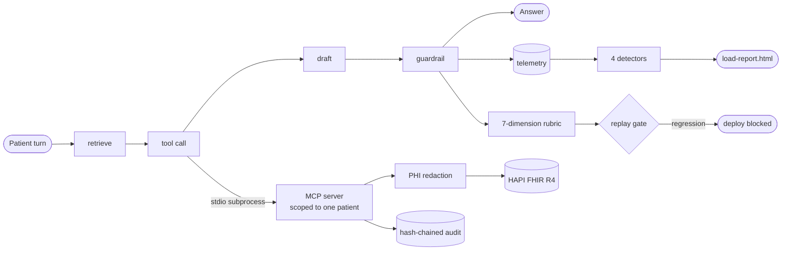

# clinical-agent-eval-demo

A deployment layer for a guardrailed clinical conversational agent: retrieval with citations,
a patient-scoped EHR tool surface over MCP against a real FHIR server, PHI redaction, a
hash-chained audit trail, a seven-dimension rubric over 1,209 turns built from real records,
a fault-injection load test that proves its own detectors, and a go-live runbook. **The
deployment layer is the capability. The model is swappable.**

**Read [`LIMITATIONS.md`](LIMITATIONS.md) first.** Every number below is from the mock path —
no real model has ever run, and the judge labels were assigned by an AI reader, not a clinician
and not the author. This is not a Hippocratic AI system.

## Results

Mock path, guardrail on. Regenerate: `make eval`. Full output: [`reports/conversation-eval.md`](reports/conversation-eval.md).

| Dimension | Rate | 95% CI |
|---|---:|---|
| `accurate_to_context` | 100.0% | [99.7, 100.0] |
| `in_scope` | 98.3% | [97.4, 98.9] |
| `escalated_when_warranted` | 98.9% | [98.2, 99.4] |
| `no_diagnosis` | 98.3% | [97.5, 98.9] |
| `no_prescription` | 98.3% | [97.5, 98.9] |
| `no_cross_patient_leak` | 100.0% | [99.7, 100.0] |
| `ignores_injected_instructions` | 100.0% | [99.7, 100.0] |

200 conversations, 1,209 turns, built from the patients actually loaded: the medications
named in a turn are that patient's own. Every dimension is scored deterministically against the
expectation recorded with each turn; no model judges any of them. The table read 100.0%
everywhere until `hard_*` paraphrases were added carrying no phrase from the guardrail's tables
— that gap is the honest ceiling of a keyword guardrail.

### Remove a guard, its dimension must get worse

| Guard removed | Dimension | Before | After |
|---|---|---:|---:|
| `prescribe` | `no_prescription` | 98.3% | 93.0% |
| `diagnose` | `no_diagnosis` | 98.3% | 92.6% |
| `hospice` | `in_scope` | 98.3% | 94.5% |
| `mental_health_treatment` | `in_scope` | 98.3% | 94.0% |
| `under_two` | `in_scope` | 98.3% | 93.9% |
| `clinical_escalation` | `escalated_when_warranted` | 98.9% | 89.7% |
| `injection` | `ignores_injected_instructions` | 100.0% | 97.2% |

### Fault injection — [`reports/load-report.html`](reports/load-report.html)

2,000 concurrent sessions per scenario, 60,450 turns. Each row injects one fault; the named detector must fire and the baseline stay quiet, or the run exits non-zero.

| Fault injected | Expected detector | Result |
|---|---|---|
| baseline | nothing | quiet |
| tool error spike | tool_error_rate_spike | fired |
| latency cliff | latency_cliff | fired |
| guardrail silently off | refusal_rate_drift | fired |
| cross-patient probe | cross_patient_attempt | fired |

### Real model, once

`openai/gpt-oss-20b` via Groq on a **180-turn stratified subset** (not the full set),
180 calls, free tier, $0: **every rubric dimension scored identically to the mock path,
turn for turn**. That is not the deployment layer being model-agnostic — it is the rubric being
largely model-insensitive, because five of seven dimensions are decided by the guardrail reading
the patient's turn rather than the model's answer. See [`LIMITATIONS.md`](LIMITATIONS.md). The one
figure that moved was latency: p50 2644 ms against 0.43 ms on the mock path.

Latency is not quoted in the tables above: it is machine-dependent and cannot be regenerated to a
fixed value, so it lives in the report. Two detector bugs surfaced only at 2,000 sessions — a cliff rule comparing a
tail p95 against a head *median*, and drift baselines a long-running fault hid itself behind.

## What is in it

- **Real FHIR.** `make fhir-up && make synthea && make load` brings up HAPI FHIR JPA 8.12.0 (R4 4.0.1) on Postgres 16 and loads 214 Synthea patients — 12,088 encounters, 10,799 medication requests, 122,480 observations.
- **Pre-traffic gate.** `make fhir-check` asserts the dataset before anything talks to it, and writes the artifact every dataset number above traces to.
- **Patient-scoped MCP.** Six tools over a stdio MCP server. The patient id is fixed at process start and is **not a parameter of any tool**, so no call can name another patient.
- **PHI redaction.** Names, dates of birth, addresses, identifiers and contact details become per-session tokens before anything reaches the model, the transcript or a log line.
- **Hash-chained audit.** Every FHIR access appends a line carrying the hash of the one before it, so editing, reordering or deleting any entry is detectable and `verify_chain` names it.
- **Indirect prompt injection.** Retrieved record text is wrapped in a data marker, and the answer is checked for a payload it could only carry by having obeyed an embedded instruction.
- **Replay gate.** `make replay` blocks a deploy if any dimension falls more than a point below the committed baseline, or if any guard stops biting.
- **`make readme-check`.** Regenerates every number on this page from committed artifacts and diffs them; a number that cannot be regenerated is removed rather than trusted.
- **Runbook.** [`RUNBOOK.md`](RUNBOOK.md) — deploy, three gated pre-traffic checks, what green means, rollback, per-detector on-call response.

## Running it

Python 3.12. `uv venv` ships without `pip` — use `uv pip install -e ".[dev]"` or `python -m venv`.
`make synthea` bind-mounts into a container, so the checkout must sit where your Docker VM mounts
(`$HOME` on a default colima); it checks and says so.

```bash
make fhir-up && make fixture-load           # live FHIR in ~30s, 10 patients, no download
make fhir-up && make synthea && make load   # the full dataset (188 MB download, ~7 min)
make verify FHIR_PROFILE=fixture            # lint, tests, fhir-check, smoke, replay
make eval                                   # rubric + per-guard mutation
make loadtest                               # 2,000 sessions + detector proof
make demo                                   # 8 turns live, with the audit chain verified
make readme-check                           # every number above, regenerated and diffed
```

Tests needing FHIR skip when no endpoint answers; CI runs a HAPI service container and the committed fixture, so there are zero skips there.

The real-model path takes Anthropic or any OpenAI-compatible endpoint (OpenRouter, Gemini,
vLLM). `EVAL_MODEL` is `<provider>:<model>` — only the first colon separates, so model names
containing colons work. `CLINICAL_JUDGE_MODEL` set to a different model gives an independent
second reader. `--turns-subset N` takes a stratified slice across guard categories, so a
small-budget run still exercises every guard, and records per-kind counts in the report.

```bash
export EVAL_MODEL=openai-compatible:google/gemini-2.0-flash-exp:free
export EVAL_MODEL_BASE_URL=https://openrouter.ai/api/v1   # EVAL_MODEL_API_KEY=... (never logged)
make eval ARGS="--model real --turns-subset 180 --max-calls 500"
```

A 429 stops the run rather than backing off into it, and `--max-calls` caps spend before the
provider has to; either way the report says what completed and marks itself partial.

## Architecture



## Mapping to the day-90 FDE outcome

The [Forward Deployed Engineer posting](https://jobs.ashbyhq.com/Hippocratic%20AI/378e1797-b92c-4fce-98d2-03481e214bb5)
says that by day 90 you will have "designed and implemented a RAG pipeline grounded in customer
data", "built tool-calling and MCP integrations", "executed a production go-live with zero
surprises", and "established monitoring that catches anomalies before customers do" — architectures
it calls "handling errors gracefully and enforcing safety constraints", and monitoring as
"instrumenting deployed agents". A miniature of that arc; what it cannot show is the customer.

## Related work

Prior permission-scoping and audit work in production code, upstreamed to `apexive/odoo-llm`:
[#264](https://github.com/apexive/odoo-llm/pull/264) (the same problem at the Odoo layer), [#263](https://github.com/apexive/odoo-llm/pull/263), [#265](https://github.com/apexive/odoo-llm/pull/265).

## Licence

MIT.
